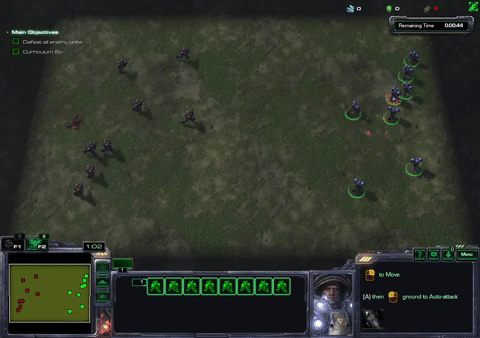

# component-action-rl
This project contains implementations of reinforcement learning algorithms in Python using TensorFlow for real-time strategy (RTS) game environments in which the action space can be viewed as a combination of multiple components (e.g. perform action X at position Y). It was made for my master's research.

Dueling Double DQN with prioritized experience replay is implemented with many, many options / hyperparameters. Network structure is completely configurable via the JSON config file. An Actor Critic implementation is also included, but not as well tested.

Some of this work was published as:

R. Kelly & D. Churchill. [Transfer Learning Between RTS Game Scenarios using Component-Action Deep RL](https://www.cs.mun.ca/~z24rmk/publications/aiide20transfer.pdf). *AIIDE-20 Workshop on Artificial Intelligence for Strategy Games*, 2020.

# Environments
## pysc2

There is a component for use with Deepmind's [pysc2](https://github.com/deepmind/pysc2) component of the StarCraft II Learning Environment, which gives a Python API for interacting with the game, designed for RL research.

Here is an example of a trained model playing an 8 marine combat scenario:



## microRTS

There is also a component for use with microRTS, a simple RTS game designed for AI research. I started working with microRTS for a while in the middle of work on pysc2, and decided not to continue with it at the time. In this project is a Python RL part using TensorFlow, sharing code with the pysc2 work. It communicates via socket with a Java SocketAI module in the microRTS project.

# Requirements
* Python 3.6.8
* Tensorflow gpu v1.14, install with `pip install --upgrade tensorflow-gpu==1.14.0`
* Cuda 10.0 and corresponding CuDNN 7.x (see https://www.tensorflow.org/install/gpu)
* StarCraft II and pysc2 Python package for StarCraft II work
* microRTS (my fork [here](https://github.com/richard-kelly/microrts)) for microRTS work

# How to run

## pysc2

**The options here are pretty clunky and too numerous, as a result of developing this as I needed for my research. Later I will likely pare it down to a simpler set of options relying a bit more on arguments and will try to keep the config file purely to training and environment parameters.**

All training and evaluation in pysc2 is done by running `pysc2_rl/pysc2_runner.py`. Most options are set using `pysc2_rl/pysc2_config.json` and optionally `pysc2_rl/batch.json`.

* To train a new model(s) or continue training/run an existing model, run the `pysc2_runner` script with no arguments.
* This script can accept one argument, which is either 1) a path to a directory containing one or more config files for running experiments; or 2) the string 'eval_dir', which is triggers an evaluation mode and is not interpreted as a path.
* If a path to a directory is given, then one run for each config file in the specified directory will be completed. The options in `pysc2_config` are used first as the 'base' options, and any options included in the experiment configs will override the base options. This makes it easy to run a similar experiment multiple times while only changing one or two options.
* To evaluate (inference only for a set number of episodes; no training) all models in a directory use  `$ python pysc2_runner eval_dir` with the directory to evaluate specified in the config `model_dir` field.
* To run scripted bots use the eval_dir mode (see above), with `inference_only` set to true and a scripted bot specified in the `use_scripted_bot` field in the config. Results will go in the folder specified as `model_dir`.
* Run existing models in eval mode with different maps by specifying the maps and a new model_dir in an experiment file, running in experiment mode, having inference_only set to true.

### pysc2_config.json

All settings for a run are set here, though they can be overode from the `batch.json` file and with settings in the experiments files using the option described above. A copy of the config file used is copied into the model directory when a run starts.

Run settings:
* **use_batch**: whether to do multiple runs with this/each config (boolean)
* **batch_file**: batch properties if above is set to true (string)
* **batch_runs**: number of runs (int) 
* **copy_model_from**: existing model dir to copy from for further training in new location. (string - blank to not use)
* **inference_only**: run an existing model with inference only; outputs eval data (boolean)
* **inference_only_realtime**: run at normal game speed; also affects console output (boolean)
* **inference_only_epsilon**: amount of random actions while in inference only mode (float - between 0 and 1)
* **inference_only_episodes**: number of episodes to do in inference only mode (int)

Player settings:
* **use_scripted_bot**: one of 'noop', 'random', 'attack_weakest', 'attack_weakest_nearest', or '' to not use a scripted bot (string)

Training settings:
* **model_dir**: location to save/load model for current run (string)
* **model_checkpoint_frequency**: trining step interval for saving model; note model is always saved on last step of training (int)
* **model_checkpoint_max**: number of checkpoints to keep (int)
* **model_checkpoint_every_n_hours**: can save every n hours instead (int)
* **max_steps**: number of steps per run; 0 for no limit (int)
* **max_episodes**: number of episodes per run; 0 for no limit (int)
* **step_penalty**: positive number here is subtracted from step rewards at each step (float)
* **episode_extra_win_reward**: additional reward for winning an episode (float)

Learning rate settings:
* **learning_rate**: starting learning rate; Adam optimizer is hard-coded currently (float)
* **learning_rate_decay_method**: 'polynomial' or 'exponential' to decay the learning rate; setting to anything else turns this feature off; doesn't really make sense for Adam (string)
* **learning_rate_decay_steps**: number of steps to decay lr over (int)
* **learning_rate_decay_param**: parameter for decay (float)

DQN options and some RL and network settings:
* **double_DQN**: whether to use Double DQN (boolean)
* **dueling_network**: whether to use dueling network (boolean)
* **bootstrapping_steps**: n-step bootstrapping (int)
* **discount**: RL discount gamma (float)
* **batch_size**: training batch size (int)
* **reg_type**: set to one of 'l1' or 'l2' for regularization (string)
* **reg_scale**: scale the regularization loss (float)

Eval episodes:
* **do_eval_episodes**: whether to do an inference_only episode every so often to track on-policy performance over time (boolean)
* **train_on_eval_episodes**: record transitions from eval episodes in memory, and do training batches while doing eval episodes
* **one_eval_episode_per**: every nth step an extra eval episode will be performed if 'do_eval_episodes' is set to true (int)

Component-action DQN loss settings:
* **loss_formula**: one of 'avg_y_compared_to_components', 'avg_y_compared_to_avg_prediction', or 'pairwise_component_comparison'; see [paper](https://www.cs.mun.ca/~z24rmk/publications/aiide20transfer.pdf) for details (string)

Memory and DQN settings:
* **update_frequency**: how often (in steps) we do a training batch (int)
* **memory_size**: size of experience replay memory (int)
* **memory_burn_in**: number of experiences to store before starting training (int)
* **target_update_frequency**: how often (in steps) to copy parameters from primary network to target network (int)

PER settings:
* **use_priority_experience_replay**: whether to use PER (boolean)
* **per_alpha**: alpha parameter from PER paper (float)
* **per_starting_beta**: beta parameter from PER paper (float)
* **per_beta_anneal_steps**: number of steps over which to anneal the beta parameter (int)
* **match_per_beta_anneal_steps_to_max**: ignore above setting and instead base on max number of training steps (boolean)
* **match_per_beta_anneal_steps_ratio**: ratio of max training steps to set beta to (float)
* **avg_component_tds**: set to true to take average of component TD absolute values instead of sum for updating priority of transitions (boolean)

epsilon-greedy settings:
* **initial_epsilon**: starting exploration epsilon (float)
* **final_epsilon**: ending exploration epsilon (float)
* **decay_steps**: number of steps over which to decay epsilon (int)
* **decay_type**: set to 'exponential' or 'linear' for decay, or anything else to have constant epsilon (string)
* **match_epsilon_decay_steps_to_max**: ignore 'decay_steps' and instead anneal epsilon over some percentage of max training steps (boolean)
* **match_epsilon_decay_steps_ratio**: ratio of max steps to use if above set to true (float)

Some debug settings:
* **debug_logging**: prints out times in ms for some parts of training (boolean)
* **log_frequency**: averages over given number of training steps (int)

Network structure:
* **network_structure**: defines the network, see below for format (object)
  * **shared_spatial_network**: first part of network (object)
  * **value_network**: value branch if using dueling nets (object)
  * **shared_non_spatial_network**: shared branch of all non-spatial components (object)
  * **component_stream_default**: network to use for individual component parts if none specified below (object)
  * **component_stream_specs**: one field for each component (object)
    * **component_name**: network definition (object)
  * **end_spatial_streams_with_dense_instead_of_flatten**: alternative end to spatial stream structure (boolean)
  * **use_stream_outputs_as_inputs_to_other_streams**: give information about choice in one action component to stream of another action component (boolean)
  * **stream_dependencies**: if above option is true, this defines which stream outputs go to which inputs. No cycles! (object)
    * **stream_name**: list of dependencies (list of strings)
  * **default_activation**: one of 'relu' or 'leaky_relu'; more can be added in `commmon/network_utils.py` (string)
  * **scale_gradients_at_shared_spatial_split**: scales gradients according to number of streams divirging from one point where spatial streams diverge (boolean)
  * **scale_gradients_at_shared_non_spatial_split**: scales gradients according to number of non-spatial streams where they diverge (boolean)
  * **use_histograms**: output histogram tensorboard data for all variables; takes lots of space (boolean)

Environment-specific settings:
* **env**: properties related to pysc2 (object)
  * **screen_size**: square resolution of screen features (int)
  * **minimap_size**: square resolution of minimap features (int)
  * **map_name**: must match filename of an included map without extension (string)
  * **visualize**: enable pysc2 visualization (boolean)
  * **step_mul**: number of steps to skip before receiving an observation and taking an action (int)
  * **action_functions**: list of objects defining which pysc2 actions to allow; properties of objects follows (list)
    * **type**: either 'include_list', 'include_range', 'exclude_list', or 'exclude_range' (string)
    * **list**: if type is list then list of 1 or more action IDs (see pysc2.lib.actions) to include/exclude; if type is range then list of 2 ints, lower and upper bound of range inclusive (list of ints)
  * **use_screen**: whether to use 'screen' component. If false then actions with screen parameter use random screen position (boolean)
  * **use_screen2**: whether to use second screen component for select_rect action. If false then a square area around the 'screen' position is selected (boolean)
  * **use_queue**: whether to use the queue paramter/component. If false then queue parameter is always false (boolean)
  * **use_select_add**: whether to use the select_add paramter/component. If false then select_add parameter is always false (boolean)
  * **select_rect_half_size**: if use_screen2 is false then this value is half the width/height of the square selected, centered on the screen position (int)
  * **use_all_unit_types**: if true includes unit type of units in state information, which goes through an embedding layer with output size 4 (boolean)
  * **use_specific_unit_types**: if true includes unit types of specific units (next option) in state, one-hot encoded (boolean)
  * **specific_unit_types**: list of unit_type IDs from pysc2 to look for (list of ints)
  * **use_hp_log_values**: state has log(hp) as one feature layer (boolean)
  * **use_shield_log_values**: state has log(shields) as one feature layer (boolean)
  * **use_hp_ratios**: state includes ratio of full health as one feature layer (boolean)
  * **use_shield_ratios**: state includes ratio of full shields as one feature layer (boolean)
  * **use_hp_cats**: state includes one hot encoding of hp categories, specified in next option (boolean)
  * **hp_cats_values**: list of values to categorize hp on with one more category than numbers in list, e.g. [30, 60] creates 3 categories, below 30, between 30 and 60, and above 60 (list of ints)
  * **use_shield_cats**: state includes one hot encoding of shield categories, specified in next option (boolean)
  * **shield_cats_values**: list of values to categorize shields on (list of ints)
  * **use_combined_hp_shields**: include sum of hp and shileds categories as feature layers
  * **combined_hp_shield_cats**: list of values to categorize sum of hp and shields on (list of ints)
  * **use_buffs**: include feature layer(s) one hot encoded with each buff ID listed in next option (boolean)
  * **buff_ids**: list of buff IDs to recognize; see pysc2.lib.buffs (list of ints)


### batch.json

If using the batch mode to do multiple runs, this file can specify certain properties to randomize during each run. There are 3 fields in the `batch.json` object:
* **log_random**: log of values in range (floats) is uniformly random (object)
* **random**: random values (floats) in range (object)
* **random_int**: random values (ints) in range (object)

Each of those fields can be empty, meaning nothing will be randomized. To randomize a property, it should be listed as a field name inside one of the three objects, with its value also an object with the following properties:
* **min**: min value (float or int)
* **max**: max value (float or int)

For example, to randomize both learning rate and max number of steps for each run, use this in `batch.json`:
```json
{
    "log_random": {
        "learning_rate": {
            "min": 1e-6,
            "max": 5e-3
        }
    },
    "random":{
    
    },
    "random_int":{
        "max_steps": {
            "min": 100000,
            "max": 500000
        }
    }
}
```

### Network Structure

Each network specification in `pysc2_config.json` is a list, with various types as valid elements. The elements in the list define that part of the network sequentially.

* **'bn'**                   - batch norm
* **'relu'**                 - ReLU activation
* **'leaky_relu'**           - Leaky ReLU activation
* **'flatten'**              - reshapes to 2D; first dimension is batch size
* **'concat_extra'**         - concatenates on last dimension with tensors from any stream dependencies when using the 'use_stream_outputs_as_inputs_to_other_streams' option
* **int**                    - dense layer with *int* units, then default activation, then batch norm
* **[]**                     - recursive new network specification for each element (must be lists) in list, then concatenate all outputs on last dimension
* **{'type': object}**  - various, depends on type field of object (other parameters listed here for each type)
  * **max_pool**             - pool_size, strides, padding (see tf.layers.max_pooling2d)
  * **avg_pool**             - pool_size, strides, padding (see tf.layers.average_pooling2d)
  * **dense**                - units (no activation or batchnorm)
  * **dense_act**            - units (no batch norm)
  * **resblock**             - filters, kernel_size, count \[number of conv layers\], downsample \[optional boolean\], original \[optional boolean - use original resblock, or modified version with pre-activation\]
  * **conv_act_bn**          - filters, kernel_size, stride \[optional\]
  * **conv_act**             - filters, kernel_size, stride \[optional\]
  * **conv**                 - filters, kernel_size, stride \[optional\]
  
### Maps

This project can be used to play the full game of SC2, but is really meant for smaller scenarios such as the ones included with the repo. They are adapted from one of the minigames included in the pysc2 package. All maps are located in `maps/combat_scenarios`. Only the name of the map (without extension) is required in the config file, not the full path.

Certain information is encoded in the map names and interpreted in `pysc2_runner`:
* if the name starts with "combat", then the map gives a shaped reward signal; otherwise reward is win/loss
* if the map name contains 'factor_int' where 'int' is a number, then rewards are divided by the number given. This is used because the reward information output by the map has to be an integer, and we actually want rewards as floats between -1 and 1, generally.
* if the map name contains 'control_int' where 'int' is a number, then there are that many pre-assigned control groups for the friendly units, and the select control group action is automatically added to the available action functions, with only those groups able to be selected. 

The other parts of the map names are just naming conventions describing what the map does:
* '8m' is 8 Marines per side, 32z is 32 Zerglings, etc.; s is Stalkers, and h is Hydralisks
* LTD2 is the reward formula. Other formulas are LTD and LTD2S, which includes shields as well as health
* 'on_damage' or 'on_death' specifies whether rewards are given based on units taking damage or on death only
* 'norm' means rewards are normalized so that the unit with the most health/shields in the scenario is worth 1 point.
* preselect indicates that all the friendly units are selected at scenario start (for testing without the select actions)
